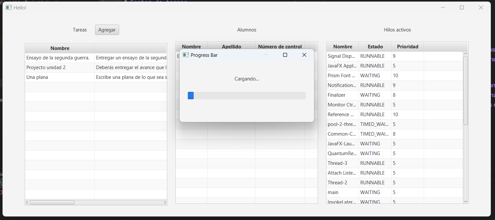
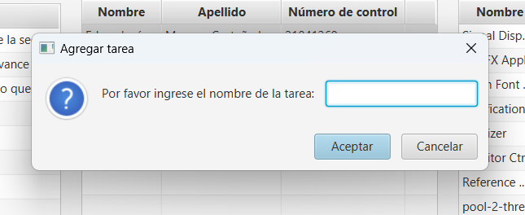
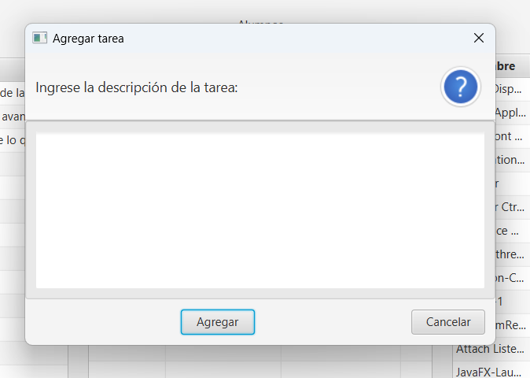
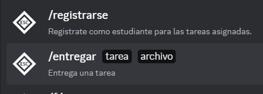
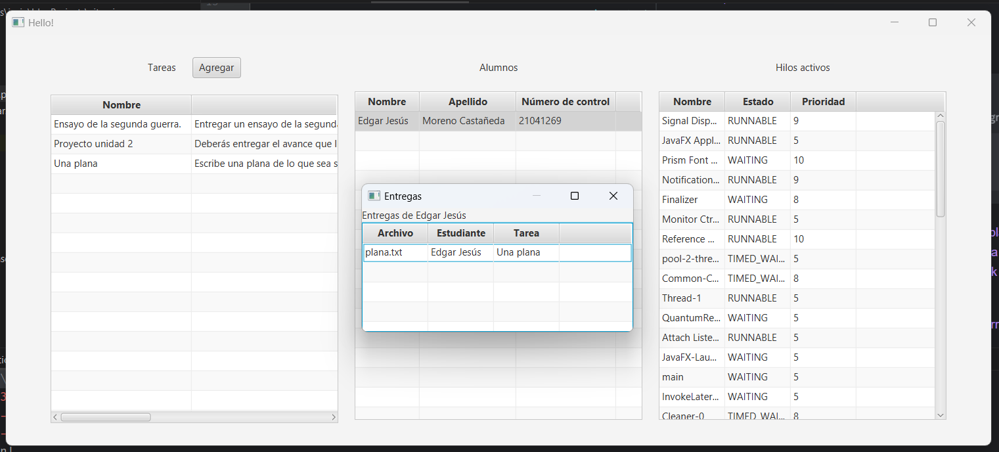

# Gestor de tareas

Este es un gestor de tareas que permite encargarle tareas a sus estudiantes los cuales recibirán una notificación
instantánea de la tarea asignada mediante la aplicación de Discord.

Al momento de ejecutar el programa, se mostrará una barra de carga que esperará a que cargue por completo el bot de
Discord, una vez cargado, se mostrarán tres tablas correspondientes a las opciones que tiene el usuario.

Una vez cargado el bot, se mostrará una tabla con las opciones y tablas que tiene el usuario, las cuales son:
* Tareas
* Estudiantes
* Hilos activos en el programa

El usuario solo puede agregar tareas, al agregar una tarea se notificarán a todos los estudiantes que estén registrados
con el bot de Discord en DM. El formulario para agregar la tarea pedirá el nombre de la tarea y una descripción, y se
asignará un plazo por defecto de una semana.

Los estudiantes pueden registrarse y entregar tareas mediante el bot de Discord, usando los comandos:
* /registrarse
* /entregar [tarea], [archivo adjunto]

Al momento de agregar una entrega, se agregará a la tabla de entregas, a la cuál se puede acceder dando doble click a
cualquiera de los estudiantes en la tabla de estudiantes o dando doble click a la tarea en la tabla de tareas.

Al darle doble click a una entrega, se abrirá el archivo correspondiente.

## Instalación

Para instalar el programa, se debe clonar el repositorio y ejecutar el archivo
`src/main/java/com/example/citas_java/HelloApplication.java` con el IDE de su preferencia. Debe tomar en cuenta que
para que la aplicación pueda cargar correctamente, en los argumentos del programa debe agregar el token de su bot de
Discord, además de que su institución debe tener acceso a internet y no debe tener bloqueado el dominio `discord.com`.

En mi caso, mi institución tiene un proxy que bloquea el dominio `discord.com`, por lo que hice este README.md para
poder mostrar el funcionamiento del programa.